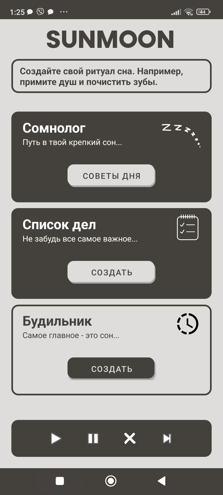
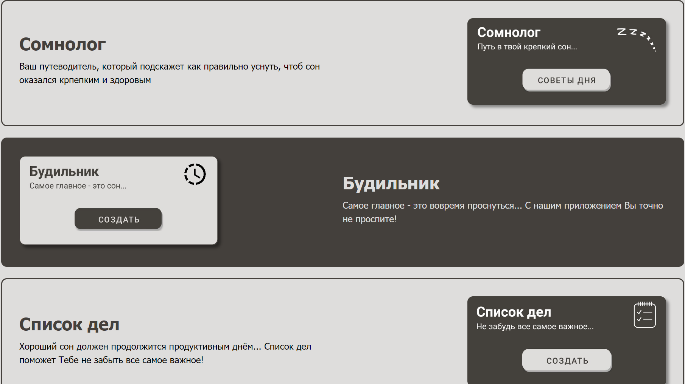

<br/>
<p align="center">
  <a href="https://sunmoonapp.000webhostapp.com/">
    
  </a>

  <h2 align="center">
    Sunmoon - помощник вашего сна
    <br/>
    <br/>
  </h2>
</p>


<p align="center">
    


</p>

<p align="center" font-size="24px">
  Sunmoon - это приложение, которое поможет Вам расслабится перед сном, составить список дел на следующий день, а также не забыть проснуться.
</p>


### Installation

1. Get a free API Key at [https://example.com](https://example.com)

2. Clone the repo

```sh
git clone https://github.com/your_username_/Project-Name.git
```

3. Install NPM packages

```sh
npm install
```

4. Enter your API in `config.js`

```JS
const API_KEY = 'ENTER YOUR API';
```
